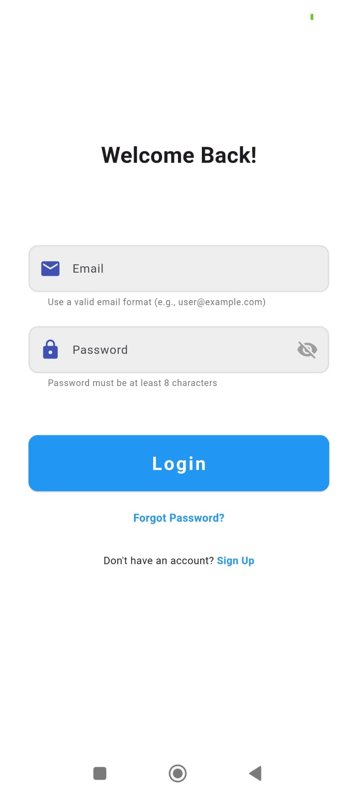
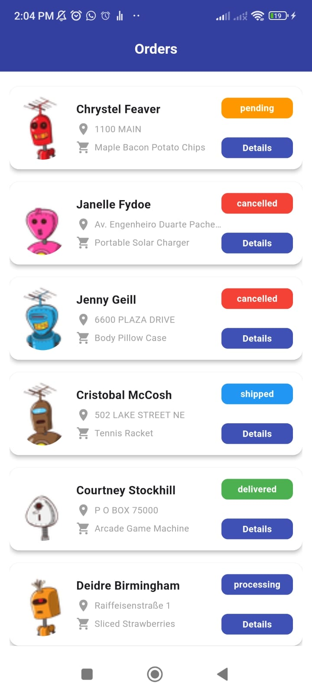
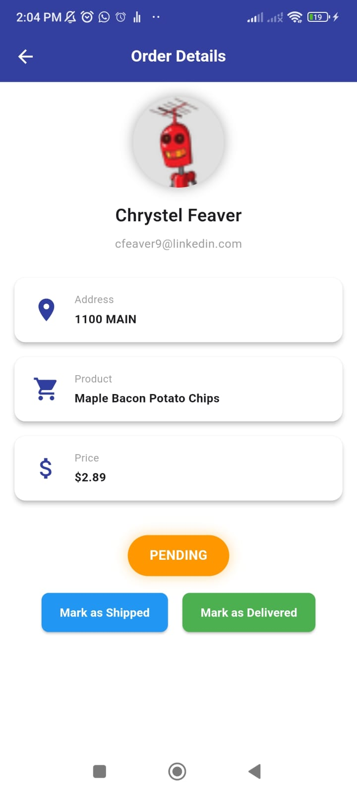

# Order Management App 🚀

An elegant and feature-packed Flutter app designed for managing orders efficiently. This app features a seamless login process, an interactive orders screen, and a detailed view of each order with easy status updates.

## Features 🌟

- **Login Screen**:
  - Secure login with email and password authentication.
  - Real-time input validation to ensure a smooth user experience.
    

- **Orders Screen**:
  - Displays a list of orders with important details: Client Name, Address, Order Status, and a "View Details" button.
  - Smooth, animated transitions between screens.
    

- **Order Details Screen**:
  - View all the details of an order, including customer information, product, price, and address.
  - Ability to update order status to "Delivered" or "Cancelled" with instant feedback.
    

- **Interactive Animations**:
  - Beautiful animations for transitions, buttons, and more, ensuring a polished and enjoyable user experience.

- **Responsive Design**:
  - Fully responsive and optimized for various screen sizes, using Flutter ScreenUtil for scaling and adaptive layouts.

## Tech Stack 💻

- **Flutter**: Cross-platform mobile development framework for both Android & iOS.
- **Dio**: A powerful HTTP client for making API requests.
- **SharedPreferences**: Efficient local storage solution for saving data securely.
- **Bloc**: Manages state and business logic in a scalable way.
- **Flutter ScreenUtil**: Ensures the app is responsive across different device screen sizes.

## Architecture 📐

The app follows **Clean Architecture** for maintainability, scalability, and separation of concerns. Here's how it's structured:

- **Model**: Represents the app’s data structures, such as `OrderEntity`.
- **Repository**: Manages data from external sources (API or local storage).
- **Presentation**: The UI layer, responsible for presenting data to the user. It also includes Cubit, which handles state and business logic in a scalable way.

